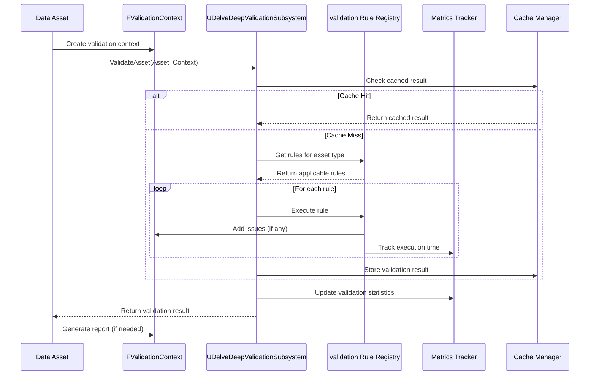

# Design Document

## Overview

The Enhanced Validation System extends the existing FValidationContext infrastructure to provide a comprehensive, production-ready validation framework for DelveDeep. The system introduces severity levels, a validation rule registry, automatic asset validation, metrics tracking, and extensibility through custom validators and delegates.

### Key Design Goals

1. **Backward Compatibility**: Maintain full compatibility with existing FValidationContext usage
2. **Performance**: Achieve <200ms initialization for 100+ assets, <1ms per validation rule
3. **Extensibility**: Support custom validators via C++, Blueprint, and delegates
4. **Developer Experience**: Provide clear error messages, comprehensive reports, and debugging tools
5. **Editor Integration**: Seamless integration with Unreal's Data Validation Plugin
6. **Metrics & Analytics**: Track validation patterns to identify common issues and optimize performance

### Architecture Principles

- **Component-Based Design**: Separate concerns into focused components (severity, rules, metrics, reporting)
- **Subsystem Pattern**: Use UGameInstanceSubsystem for centralized validation management
- **Template-Based Validation**: Provide reusable validation templates for common scenarios
- **Event-Driven Architecture**: Use delegates for extensibility without tight coupling
- **Performance-First**: Cache results, support parallel validation, profile all operations

## Architecture

### System Components

```
UDelveDeepValidationSubsystem (Game Instance Subsystem)
├── Validation Rule Registry
│   ├── Rule Registration & Management
│   ├── Rule Execution Engine
│   └── Rule Type Mapping
├── Validation Metrics Tracker
│   ├── Performance Metrics
│   ├── Error Frequency Tracking
│   └── Metrics Persistence
├── Validation Cache Manager
│   ├── Result Caching
│   ├── Cache Invalidation
│   └── Asset Change Detection
└── Validation Report Generator
    ├── Console Report Formatting
    ├── JSON Export
    ├── CSV Export
    └── HTML Export

FValidationContext (Enhanced)
├── Severity Level Support
├── Source Location Tracking
├── Timestamp & Duration
├── Nested Context Support
├── Metadata Attachment
└── Issue Categorization

Validation Rule Templates
├── Numeric Range Validation
├── Null/Valid Pointer Checks
├── Soft Reference Validation
├── String Validation
├── Array Size Validation
└── Enum Validation

Editor Integration (WITH_EDITOR)
├── Data Validation Plugin Integration
├── Asset Save Hooks
├── Message Log Integration
└── Validation Commands
```


### Component Interaction Flow



### Data Flow

1. **Validation Initiation**: Asset PostLoad() or explicit validation call
2. **Cache Check**: Subsystem checks if asset has cached validation result
3. **Rule Discovery**: Registry identifies applicable rules for asset type
4. **Rule Execution**: Each rule executes and adds issues to context
5. **Metrics Update**: Performance and frequency metrics updated
6. **Cache Storage**: Result cached for future validations
7. **Report Generation**: Context generates formatted report on demand

## Components and Interfaces

### 1. Enhanced FValidationContext

**File**: `Source/DelveDeep/Public/DelveDeepValidation.h`

#### Severity Enum

```cpp
UENUM(BlueprintType)
enum class EValidationSeverity : uint8
{
    Critical    UMETA(DisplayName = "Critical"),  // Prevents operation, logs as Error
    Error       UMETA(DisplayName = "Error"),     // Prevents operation, logs as Error
    Warning     UMETA(DisplayName = "Warning"),   // Allows operation, logs as Warning
    Info        UMETA(DisplayName = "Info")       // Informational, logs as Display
};
```

#### Validation Issue Struct

```cpp
USTRUCT(BlueprintType)
struct DELVEDEEP_API FValidationIssue
{
    GENERATED_BODY()

    UPROPERTY(BlueprintReadOnly, Category = "Validation")
    EValidationSeverity Severity = EValidationSeverity::Error;

    UPROPERTY(BlueprintReadOnly, Category = "Validation")
    FString Message;

    UPROPERTY(BlueprintReadOnly, Category = "Validation")
    FString SourceFile;

    UPROPERTY(BlueprintReadOnly, Category = "Validation")
    int32 SourceLine = 0;

    UPROPERTY(BlueprintReadOnly, Category = "Validation")
    FString SourceFunction;

    UPROPERTY(BlueprintReadOnly, Category = "Validation")
    FDateTime Timestamp;

    UPROPERTY(BlueprintReadOnly, Category = "Validation")
    TMap<FString, FString> Metadata;
};
```


#### Enhanced FValidationContext

```cpp
USTRUCT(BlueprintType)
struct DELVEDEEP_API FValidationContext
{
    GENERATED_BODY()

    // Existing fields (backward compatible)
    UPROPERTY(BlueprintReadOnly, Category = "Validation")
    FString SystemName;

    UPROPERTY(BlueprintReadOnly, Category = "Validation")
    FString OperationName;

    // Legacy arrays (maintained for backward compatibility)
    UPROPERTY(BlueprintReadOnly, Category = "Validation")
    TArray<FString> ValidationErrors;

    UPROPERTY(BlueprintReadOnly, Category = "Validation")
    TArray<FString> ValidationWarnings;

    // New fields
    UPROPERTY(BlueprintReadOnly, Category = "Validation")
    TArray<FValidationIssue> Issues;

    UPROPERTY(BlueprintReadOnly, Category = "Validation")
    FDateTime CreationTime;

    UPROPERTY(BlueprintReadOnly, Category = "Validation")
    FDateTime CompletionTime;

    UPROPERTY(BlueprintReadOnly, Category = "Validation")
    TArray<FValidationContext> ChildContexts;

    // Existing methods (backward compatible)
    void AddError(const FString& Error);
    void AddWarning(const FString& Warning);
    bool IsValid() const;
    FString GetReport() const;
    void Reset();

    // New methods
    void AddIssue(EValidationSeverity Severity, const FString& Message, 
                  const FString& SourceFile = "", int32 SourceLine = 0, 
                  const FString& SourceFunction = "");
    void AddCritical(const FString& Message);
    void AddInfo(const FString& Message);
    bool HasCriticalIssues() const;
    bool HasErrors() const;
    bool HasWarnings() const;
    int32 GetIssueCount(EValidationSeverity Severity) const;
    void AddChildContext(const FValidationContext& ChildContext);
    void MergeContext(const FValidationContext& OtherContext);
    void AttachMetadata(const FString& Key, const FString& Value);
    FTimespan GetValidationDuration() const;
    FString GetReportJSON() const;
    FString GetReportCSV() const;
    FString GetReportHTML() const;
};
```

### 2. Validation Rule System

**File**: `Source/DelveDeep/Public/DelveDeepValidationRules.h`

#### Validation Rule Delegate

```cpp
DECLARE_DELEGATE_RetVal_TwoParams(bool, FValidationRuleDelegate, 
    const UObject* /* Object */, FValidationContext& /* Context */);
```

#### Validation Rule Definition

```cpp
USTRUCT()
struct DELVEDEEP_API FValidationRuleDefinition
{
    GENERATED_BODY()

    FName RuleName;
    UClass* TargetClass = nullptr;
    FValidationRuleDelegate RuleDelegate;
    bool bEnabled = true;
    int32 Priority = 0; // Higher priority rules execute first
    FString Description;
};
```


### 3. Validation Subsystem

**File**: `Source/DelveDeep/Public/DelveDeepValidationSubsystem.h`

```cpp
UCLASS()
class DELVEDEEP_API UDelveDeepValidationSubsystem : public UGameInstanceSubsystem
{
    GENERATED_BODY()

public:
    // Subsystem lifecycle
    virtual void Initialize(FSubsystemCollectionBase& Collection) override;
    virtual void Deinitialize() override;

    // Rule registration
    UFUNCTION(BlueprintCallable, Category = "DelveDeep|Validation")
    void RegisterValidationRule(FName RuleName, UClass* TargetClass, 
                                const FValidationRuleDelegate& RuleDelegate,
                                int32 Priority = 0, const FString& Description = "");

    UFUNCTION(BlueprintCallable, Category = "DelveDeep|Validation")
    void UnregisterValidationRule(FName RuleName);

    UFUNCTION(BlueprintCallable, Category = "DelveDeep|Validation")
    void UnregisterAllRulesForClass(UClass* TargetClass);

    // Validation execution
    UFUNCTION(BlueprintCallable, Category = "DelveDeep|Validation")
    bool ValidateObject(const UObject* Object, FValidationContext& Context);

    UFUNCTION(BlueprintCallable, Category = "DelveDeep|Validation")
    bool ValidateObjectWithCache(const UObject* Object, FValidationContext& Context);

    // Batch validation
    UFUNCTION(BlueprintCallable, Category = "DelveDeep|Validation")
    void ValidateObjects(const TArray<UObject*>& Objects, 
                        TArray<FValidationContext>& OutContexts);

    // Cache management
    UFUNCTION(BlueprintCallable, Category = "DelveDeep|Validation")
    void InvalidateCache(const UObject* Object);

    UFUNCTION(BlueprintCallable, Category = "DelveDeep|Validation")
    void ClearValidationCache();

    // Metrics
    UFUNCTION(BlueprintCallable, Category = "DelveDeep|Validation")
    FString GetValidationMetricsReport() const;

    UFUNCTION(BlueprintCallable, Category = "DelveDeep|Validation")
    void ResetValidationMetrics();

    // Delegates
    DECLARE_MULTICAST_DELEGATE_TwoParams(FOnPreValidation, 
        const UObject* /* Object */, FValidationContext& /* Context */);
    FOnPreValidation OnPreValidation;

    DECLARE_MULTICAST_DELEGATE_TwoParams(FOnPostValidation, 
        const UObject* /* Object */, const FValidationContext& /* Context */);
    FOnPostValidation OnPostValidation;

    DECLARE_MULTICAST_DELEGATE_TwoParams(FOnCriticalIssue, 
        const UObject* /* Object */, const FValidationIssue& /* Issue */);
    FOnCriticalIssue OnCriticalIssue;

private:
    // Rule storage
    TMap<UClass*, TArray<FValidationRuleDefinition>> RegisteredRules;

    // Validation cache
    TMap<const UObject*, FValidationContext> ValidationCache;
    TMap<const UObject*, FDateTime> CacheTimestamps;

    // Metrics
    struct FValidationMetrics
    {
        int32 TotalValidations = 0;
        int32 PassedValidations = 0;
        int32 FailedValidations = 0;
        TMap<FString, int32> ErrorFrequency;
        TMap<FName, double> RuleExecutionTimes;
        TMap<FString, double> SystemExecutionTimes;
    };
    FValidationMetrics Metrics;

    // Helper methods
    void ExecuteRulesForObject(const UObject* Object, FValidationContext& Context);
    void UpdateMetrics(const FValidationContext& Context, double ExecutionTime);
    bool IsCacheValid(const UObject* Object) const;
};
```


### 4. Validation Rule Templates

**File**: `Source/DelveDeep/Public/DelveDeepValidationTemplates.h`

```cpp
namespace DelveDeepValidation
{
    // Numeric range validation
    template<typename T>
    bool ValidateRange(T Value, T Min, T Max, const FString& PropertyName, 
                      FValidationContext& Context)
    {
        if (Value < Min || Value > Max)
        {
            Context.AddError(FString::Printf(
                TEXT("%s out of range: %s (expected %s-%s)"),
                *PropertyName, *LexToString(Value), *LexToString(Min), *LexToString(Max)));
            return false;
        }
        return true;
    }

    // Pointer validation
    template<typename T>
    bool ValidatePointer(const T* Pointer, const FString& PropertyName, 
                        FValidationContext& Context, bool bAllowNull = false)
    {
        if (!bAllowNull && !Pointer)
        {
            Context.AddError(FString::Printf(TEXT("%s is null"), *PropertyName));
            return false;
        }
        
        if (Pointer && !IsValid(Pointer))
        {
            Context.AddError(FString::Printf(TEXT("%s is invalid"), *PropertyName));
            return false;
        }
        
        return true;
    }

    // Soft reference validation
    template<typename T>
    bool ValidateSoftReference(const TSoftObjectPtr<T>& SoftPtr, 
                              const FString& PropertyName,
                              FValidationContext& Context, bool bAllowNull = false)
    {
        if (!bAllowNull && SoftPtr.IsNull())
        {
            Context.AddError(FString::Printf(
                TEXT("%s soft reference is null"), *PropertyName));
            return false;
        }
        return true;
    }

    // String validation
    bool ValidateString(const FString& Value, const FString& PropertyName,
                       FValidationContext& Context, int32 MinLength = 0, 
                       int32 MaxLength = MAX_int32, bool bAllowEmpty = false);

    // Array size validation
    template<typename T>
    bool ValidateArraySize(const TArray<T>& Array, const FString& PropertyName,
                          FValidationContext& Context, int32 MinSize = 0, 
                          int32 MaxSize = MAX_int32)
    {
        int32 Size = Array.Num();
        if (Size < MinSize || Size > MaxSize)
        {
            Context.AddError(FString::Printf(
                TEXT("%s array size out of range: %d (expected %d-%d)"),
                *PropertyName, Size, MinSize, MaxSize));
            return false;
        }
        return true;
    }

    // Enum validation
    template<typename T>
    bool ValidateEnum(T Value, const FString& PropertyName, 
                     FValidationContext& Context)
    {
        UEnum* EnumClass = StaticEnum<T>();
        if (!EnumClass || !EnumClass->IsValidEnumValue(static_cast<int64>(Value)))
        {
            Context.AddError(FString::Printf(
                TEXT("%s has invalid enum value: %d"), 
                *PropertyName, static_cast<int32>(Value)));
            return false;
        }
        return true;
    }
}
```


### 5. Blueprint Validation Interface

**File**: `Source/DelveDeep/Public/DelveDeepValidationInterface.h`

```cpp
UINTERFACE(MinimalAPI, Blueprintable)
class UDelveDeepValidatable : public UInterface
{
    GENERATED_BODY()
};

class IDelveDeepValidatable
{
    GENERATED_BODY()

public:
    UFUNCTION(BlueprintNativeEvent, BlueprintCallable, Category = "Validation")
    bool ValidateData(FValidationContext& Context);
};
```

### 6. Editor Integration

**File**: `Source/DelveDeep/Public/DelveDeepValidationEditor.h` (WITH_EDITOR only)

```cpp
#if WITH_EDITOR

class DELVEDEEP_API FDelveDeepValidationEditor
{
public:
    static void Initialize();
    static void Shutdown();

    // Asset validation hooks
    static void OnAssetPreSave(UObject* Asset);
    static void OnAssetPostSave(UObject* Asset);

    // Validation commands
    static void ValidateAssetByPath(const FString& AssetPath);
    static void ValidateAssetsInDirectory(const FString& DirectoryPath);
    static void ValidateAllAssets();

    // Message log integration
    static void LogValidationResults(const FValidationContext& Context, 
                                     const FString& AssetPath);
};

#endif // WITH_EDITOR
```

## Data Models

### Validation Metrics Data

```cpp
USTRUCT(BlueprintType)
struct DELVEDEEP_API FValidationMetricsData
{
    GENERATED_BODY()

    UPROPERTY(BlueprintReadOnly, Category = "Metrics")
    int32 TotalValidations = 0;

    UPROPERTY(BlueprintReadOnly, Category = "Metrics")
    int32 PassedValidations = 0;

    UPROPERTY(BlueprintReadOnly, Category = "Metrics")
    int32 FailedValidations = 0;

    UPROPERTY(BlueprintReadOnly, Category = "Metrics")
    TMap<FString, int32> ErrorFrequency;

    UPROPERTY(BlueprintReadOnly, Category = "Metrics")
    TMap<FString, float> AverageRuleExecutionTime;

    UPROPERTY(BlueprintReadOnly, Category = "Metrics")
    TMap<FString, float> SystemExecutionTime;

    UPROPERTY(BlueprintReadOnly, Category = "Metrics")
    FDateTime LastResetTime;
};
```

### Validation Cache Entry

```cpp
struct FValidationCacheEntry
{
    FValidationContext CachedContext;
    FDateTime CacheTime;
    uint32 AssetHash; // For detecting asset changes
    bool bIsValid;
};
```


## Error Handling

### Validation Failure Scenarios

1. **Null Object Validation**
   - **Scenario**: ValidateObject() called with nullptr
   - **Handling**: Log error, return false, add error to context
   - **Recovery**: Caller should check for null before validation

2. **No Rules Registered**
   - **Scenario**: Validation requested for type with no registered rules
   - **Handling**: Log warning, return true (no rules to fail)
   - **Recovery**: System continues, validation passes by default

3. **Rule Execution Exception**
   - **Scenario**: Validation rule throws exception during execution
   - **Handling**: Catch exception, log error, add critical issue to context
   - **Recovery**: Continue with remaining rules, mark validation as failed

4. **Cache Corruption**
   - **Scenario**: Cached validation result is corrupted or invalid
   - **Handling**: Invalidate cache entry, re-run validation
   - **Recovery**: Fresh validation performed, new result cached

5. **Metrics Persistence Failure**
   - **Scenario**: Unable to save metrics to disk
   - **Handling**: Log warning, continue with in-memory metrics
   - **Recovery**: Metrics available for current session, retry on next save

6. **Circular Validation Dependencies**
   - **Scenario**: Nested validation creates circular reference
   - **Handling**: Detect cycle, log error, break cycle
   - **Recovery**: Validation continues without circular reference

### Error Logging Strategy

```cpp
// Critical issues (prevent operation)
UE_LOG(LogDelveDeepValidation, Error, 
    TEXT("[%s::%s] Critical: %s"), *SystemName, *OperationName, *Message);

// Errors (validation failed)
UE_LOG(LogDelveDeepValidation, Error, 
    TEXT("[%s::%s] Error: %s"), *SystemName, *OperationName, *Message);

// Warnings (potential issues)
UE_LOG(LogDelveDeepValidation, Warning, 
    TEXT("[%s::%s] Warning: %s"), *SystemName, *OperationName, *Message);

// Info (informational)
UE_LOG(LogDelveDeepValidation, Display, 
    TEXT("[%s::%s] Info: %s"), *SystemName, *OperationName, *Message);
```

### Graceful Degradation

- **No Subsystem Available**: Fall back to basic FValidationContext usage
- **Cache Disabled**: Perform validation without caching
- **Metrics Disabled**: Skip metrics tracking, continue validation
- **Editor Features Unavailable**: Runtime validation continues without Editor integration

## Testing Strategy

### Unit Tests

**File**: `Source/DelveDeep/Private/Tests/EnhancedValidationTests.cpp`

1. **Severity Level Tests**
   - Test adding issues with each severity level
   - Verify correct logging for each severity
   - Test IsValid() behavior with different severities

2. **Validation Rule Tests**
   - Test rule registration and unregistration
   - Test rule execution order (priority)
   - Test rule execution with multiple rules per type

3. **Validation Context Tests**
   - Test nested context creation and merging
   - Test metadata attachment and retrieval
   - Test timestamp and duration tracking
   - Test report generation (console, JSON, CSV, HTML)

4. **Template Validation Tests**
   - Test numeric range validation
   - Test pointer validation
   - Test soft reference validation
   - Test string validation
   - Test array size validation
   - Test enum validation

5. **Cache Tests**
   - Test cache hit/miss behavior
   - Test cache invalidation
   - Test cache performance improvement

6. **Metrics Tests**
   - Test metrics tracking accuracy
   - Test metrics persistence and loading
   - Test metrics reset functionality


### Integration Tests

**File**: `Source/DelveDeep/Private/Tests/ValidationIntegrationTests.cpp`

1. **Subsystem Integration**
   - Test subsystem initialization and lifecycle
   - Test validation through subsystem
   - Test delegate firing during validation

2. **Data Asset Integration**
   - Test automatic validation in PostLoad()
   - Test validation with existing data assets
   - Test backward compatibility with existing validation code

3. **Configuration Manager Integration**
   - Test validation during configuration loading
   - Test validation cache with configuration manager
   - Test hot-reload with validation

4. **Editor Integration** (WITH_EDITOR)
   - Test asset save validation
   - Test message log integration
   - Test validation commands

### Performance Tests

**File**: `Source/DelveDeep/Private/Tests/ValidationPerformanceTests.cpp`

1. **Initialization Performance**
   - Measure subsystem initialization time
   - Target: <50ms for subsystem init

2. **Validation Performance**
   - Measure single validation execution time
   - Target: <1ms per validation rule
   - Measure batch validation of 100+ assets
   - Target: <200ms for 100 assets

3. **Cache Performance**
   - Measure cache hit vs miss performance
   - Target: >90% cache hit rate for repeated validations
   - Measure cache lookup time
   - Target: <0.1ms per cache lookup

4. **Metrics Performance**
   - Measure metrics tracking overhead
   - Target: <5% overhead on validation time

### Console Commands for Testing

```cpp
// Validation testing
DelveDeep.ValidateObject [ObjectPath]
DelveDeep.ValidateAllAssets
DelveDeep.ValidateDirectory [Path]

// Rule management
DelveDeep.ListValidationRules
DelveDeep.ListRulesForClass [ClassName]
DelveDeep.EnableValidationRule [RuleName]
DelveDeep.DisableValidationRule [RuleName]

// Cache management
DelveDeep.ShowValidationCache
DelveDeep.ClearValidationCache
DelveDeep.InvalidateCacheForObject [ObjectPath]

// Metrics
DelveDeep.ShowValidationMetrics
DelveDeep.ResetValidationMetrics
DelveDeep.ExportValidationMetrics [Format] [FilePath]

// Testing
DelveDeep.TestValidationSeverity
DelveDeep.TestValidationRules
DelveDeep.TestValidationCache
DelveDeep.ProfileValidation [ObjectPath]
```

## Performance Considerations

### Optimization Strategies

1. **Validation Caching**
   - Cache validation results for unchanged assets
   - Use asset hash to detect changes
   - Invalidate cache on asset modification
   - Target: >90% cache hit rate

2. **Parallel Validation**
   - Use ParallelFor for batch validation
   - Validate independent assets concurrently
   - Thread-safe metrics tracking
   - Target: 2-4x speedup on multi-core systems

3. **Rule Execution Optimization**
   - Sort rules by priority before execution
   - Early exit on critical issues (optional)
   - Profile slow rules and optimize
   - Target: <1ms per rule execution

4. **Memory Management**
   - Pre-allocate arrays for known sizes
   - Use TMap for O(1) rule lookup
   - Clear cache periodically to prevent memory growth
   - Target: <10MB memory overhead

5. **Lazy Report Generation**
   - Generate reports on-demand, not automatically
   - Cache formatted reports when possible
   - Use string builders for efficient concatenation

### Performance Profiling

```cpp
DECLARE_STATS_GROUP(TEXT("DelveDeepValidation"), STATGROUP_DelveDeepValidation, STATCAT_Advanced);
DECLARE_CYCLE_STAT(TEXT("Validate Object"), STAT_ValidateObject, STATGROUP_DelveDeepValidation);
DECLARE_CYCLE_STAT(TEXT("Execute Rule"), STAT_ExecuteRule, STATGROUP_DelveDeepValidation);
DECLARE_CYCLE_STAT(TEXT("Cache Lookup"), STAT_CacheLookup, STATGROUP_DelveDeepValidation);
DECLARE_CYCLE_STAT(TEXT("Generate Report"), STAT_GenerateReport, STATGROUP_DelveDeepValidation);
```


### Performance Targets

| Metric | Target | Measurement |
|--------|--------|-------------|
| Subsystem Initialization | <50ms | Time from Initialize() to ready |
| Single Validation Rule | <1ms | Average execution time per rule |
| Batch Validation (100 assets) | <200ms | Total time for 100 asset validations |
| Cache Hit Rate | >90% | Percentage of cached results used |
| Cache Lookup Time | <0.1ms | Time to check and retrieve cached result |
| Metrics Tracking Overhead | <5% | Additional time for metrics tracking |
| Memory Overhead | <10MB | Total memory used by validation system |
| Report Generation | <10ms | Time to generate formatted report |

## Integration Points

### 1. Configuration Manager Integration

```cpp
// In UDelveDeepConfigurationManager::Initialize()
void UDelveDeepConfigurationManager::Initialize(FSubsystemCollectionBase& Collection)
{
    Super::Initialize(Collection);
    
    // Get validation subsystem
    UDelveDeepValidationSubsystem* ValidationSubsystem = 
        GetGameInstance()->GetSubsystem<UDelveDeepValidationSubsystem>();
    
    if (ValidationSubsystem)
    {
        // Register validation rules for configuration data
        RegisterConfigurationValidationRules(ValidationSubsystem);
        
        // Validate all loaded data
        ValidateAllConfigurationData(ValidationSubsystem);
    }
}
```

### 2. Data Asset Integration

```cpp
// In UDelveDeepCharacterData::PostLoad()
void UDelveDeepCharacterData::PostLoad()
{
    Super::PostLoad();
    
    // Get validation subsystem
    UDelveDeepValidationSubsystem* ValidationSubsystem = 
        GetWorld()->GetGameInstance()->GetSubsystem<UDelveDeepValidationSubsystem>();
    
    FValidationContext Context;
    Context.SystemName = TEXT("Configuration");
    Context.OperationName = TEXT("LoadCharacterData");
    
    if (ValidationSubsystem)
    {
        // Use subsystem validation with caching
        ValidationSubsystem->ValidateObjectWithCache(this, Context);
    }
    else
    {
        // Fall back to basic validation
        Validate(Context);
    }
    
    if (!Context.IsValid())
    {
        UE_LOG(LogDelveDeepConfig, Error, 
            TEXT("Character data validation failed:\n%s"), *Context.GetReport());
    }
}
```

### 3. Save System Integration (Future)

```cpp
// Validate save data before writing
bool UDelveDeepSaveSystem::SaveGame(const FDelveDeepSaveData& SaveData)
{
    FValidationContext Context;
    Context.SystemName = TEXT("SaveSystem");
    Context.OperationName = TEXT("SaveGame");
    
    if (!ValidateSaveData(SaveData, Context))
    {
        UE_LOG(LogDelveDeepSave, Error, 
            TEXT("Save data validation failed:\n%s"), *Context.GetReport());
        return false;
    }
    
    // Proceed with save
    return WriteSaveData(SaveData);
}
```

### 4. Progression System Integration (Future)

```cpp
// Validate upgrade costs and dependencies
bool UDelveDeepProgressionManager::CanApplyUpgrade(FName UpgradeName)
{
    FValidationContext Context;
    Context.SystemName = TEXT("Progression");
    Context.OperationName = TEXT("ValidateUpgrade");
    
    const UDelveDeepUpgradeData* UpgradeData = GetUpgradeData(UpgradeName);
    
    if (!ValidateUpgradeRequirements(UpgradeData, Context))
    {
        // Log validation issues
        UE_LOG(LogDelveDeepProgression, Warning, 
            TEXT("Upgrade validation failed:\n%s"), *Context.GetReport());
        return false;
    }
    
    return true;
}
```


## Migration Strategy

### Backward Compatibility

The enhanced validation system maintains full backward compatibility with existing FValidationContext usage:

1. **Existing Methods Preserved**
   - `AddError()` and `AddWarning()` continue to work
   - `IsValid()` returns false if any Critical or Error issues exist
   - `GetReport()` generates reports including both legacy and new issues
   - `Reset()` clears all validation state

2. **Legacy Arrays Maintained**
   - `ValidationErrors` and `ValidationWarnings` arrays still populated
   - Existing code reading these arrays continues to work
   - New code should use `Issues` array for full severity support

3. **Gradual Migration Path**
   - Existing validation code works without changes
   - New features opt-in (severity levels, caching, metrics)
   - Systems can migrate incrementally

### Migration Steps

**Phase 1: Drop-in Replacement**
- Deploy enhanced validation system
- Existing code continues to work unchanged
- New validation features available but not required

**Phase 2: Adopt New Features**
- Update validation code to use severity levels
- Register validation rules with subsystem
- Enable validation caching for performance

**Phase 3: Full Integration**
- Migrate all validation to use subsystem
- Implement custom validators and delegates
- Enable Editor integration and metrics tracking

### Example Migration

**Before (Existing Code):**
```cpp
bool UDelveDeepCharacterData::Validate(FValidationContext& Context) const
{
    if (BaseHealth <= 0.0f)
    {
        Context.AddError(TEXT("BaseHealth must be positive"));
        return false;
    }
    
    if (StartingWeapon.IsNull())
    {
        Context.AddWarning(TEXT("No starting weapon assigned"));
    }
    
    return Context.IsValid();
}
```

**After (Enhanced Code):**
```cpp
bool UDelveDeepCharacterData::Validate(FValidationContext& Context) const
{
    // Use validation templates
    DelveDeepValidation::ValidateRange(BaseHealth, 1.0f, 10000.0f, 
        TEXT("BaseHealth"), Context);
    
    DelveDeepValidation::ValidateSoftReference(StartingWeapon, 
        TEXT("StartingWeapon"), Context, true /* allow null */);
    
    // Add info message for debugging
    Context.AddInfo(FString::Printf(
        TEXT("Validated character: %s"), *CharacterName.ToString()));
    
    return Context.IsValid();
}
```

## Documentation Requirements

### API Documentation

All public APIs must include Doxygen-style comments:

```cpp
/**
 * Validates an object using registered validation rules.
 * 
 * @param Object The object to validate (must not be null)
 * @param Context The validation context to populate with issues
 * @return True if validation passed (no Critical or Error issues), false otherwise
 * 
 * @note This function does not use caching. Use ValidateObjectWithCache() for better performance.
 * @see ValidateObjectWithCache
 */
UFUNCTION(BlueprintCallable, Category = "DelveDeep|Validation")
bool ValidateObject(const UObject* Object, FValidationContext& Context);
```

### System Documentation

Create comprehensive documentation in `Documentation/Systems/EnhancedValidationSystem.md`:

- System overview and architecture
- Usage examples for common scenarios
- API reference for all public interfaces
- Performance characteristics and optimization tips
- Integration guide for other systems
- Migration guide from basic validation
- Troubleshooting common issues

### Code Examples

Provide working examples in `Source/DelveDeep/Private/Examples/`:

- Basic validation usage
- Custom validation rule registration
- Blueprint validation implementation
- Validation template usage
- Metrics tracking and reporting
- Editor integration examples

## Future Enhancements

### Post-MVP Features

1. **Validation Profiles**
   - Different validation rule sets for different contexts (Editor, Shipping, Testing)
   - Enable/disable rules based on build configuration
   - Performance vs thoroughness trade-offs

2. **Validation Visualization**
   - Visual graph of validation dependencies
   - Interactive validation report viewer
   - Real-time validation status in Editor

3. **Machine Learning Integration**
   - Predict common validation errors
   - Suggest fixes for validation issues
   - Learn from validation patterns

4. **Distributed Validation**
   - Validate assets across multiple machines
   - Cloud-based validation for large projects
   - Validation as part of CI/CD pipeline

5. **Advanced Metrics**
   - Validation trend analysis over time
   - Correlation between validation issues and bugs
   - Team-wide validation statistics

## Appendix

### Glossary of Terms

- **Validation Context**: Container for validation state, issues, and metadata
- **Validation Rule**: Function that checks specific conditions and reports issues
- **Severity Level**: Classification of validation issues by impact
- **Validation Cache**: Storage for previously validated results
- **Validation Metrics**: Statistical data about validation performance and results
- **Validation Delegate**: Callback function for validation events
- **Validation Template**: Reusable validation function for common scenarios

### References

- Unreal Engine Data Validation Plugin Documentation
- EARS (Easy Approach to Requirements Syntax) Specification
- INCOSE Systems Engineering Handbook
- DelveDeep Configuration System Documentation
- DelveDeep Error Handling Guidelines

### Change Log

| Version | Date | Changes |
|---------|------|---------|
| 1.0 | 2025-10-23 | Initial design document |
